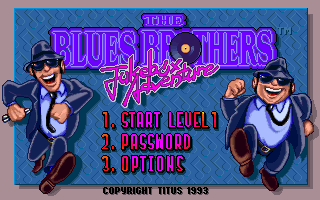
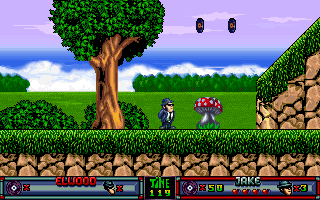

# Blues Brothers: Jukebox Adventure

This is a rewrite of the [Blues Brothers: Jukebox Adventure](https://www.mobygames.com/game/blues-brothers-jukebox-adventure) game engine made by [Titus Interactive](https://www.mobygames.com/company/titus-interactive-sa).

 


## Requirements

The game data files of the DOS version are required.

```
*.EAT, *.MOD
```


## Running

```
Usage: bbja [OPTIONS]...
  --datapath=PATH   Path to data files (default '.')
  --level=NUM       Start at level NUM
  --cheats=MASK     Cheats mask
  --startpos=XxY    Start at position (X,Y)
  --fullscreen      Enable fullscreen
  --scale=N         Graphics scaling factor (default 2)
  --filter=NAME     Graphics scaling filter (default 'nearest')
  --screensize=WxH  Graphics screen size (default 320x200)
```
